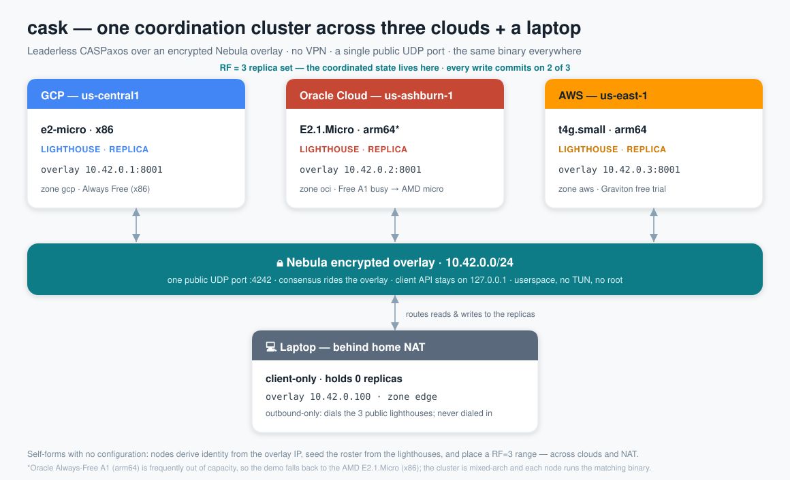
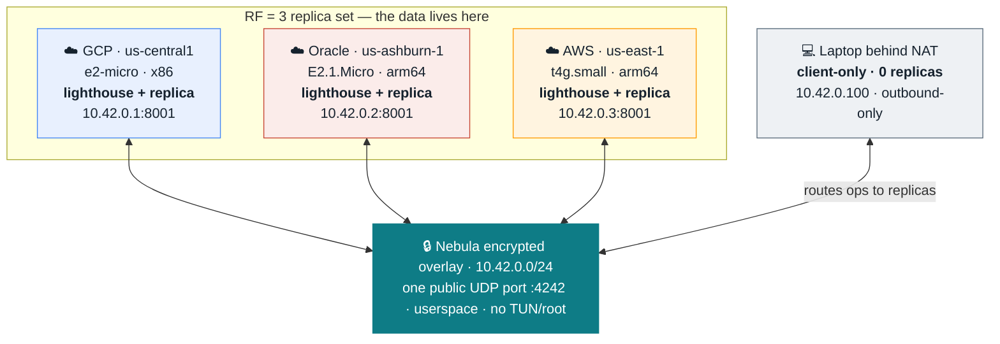
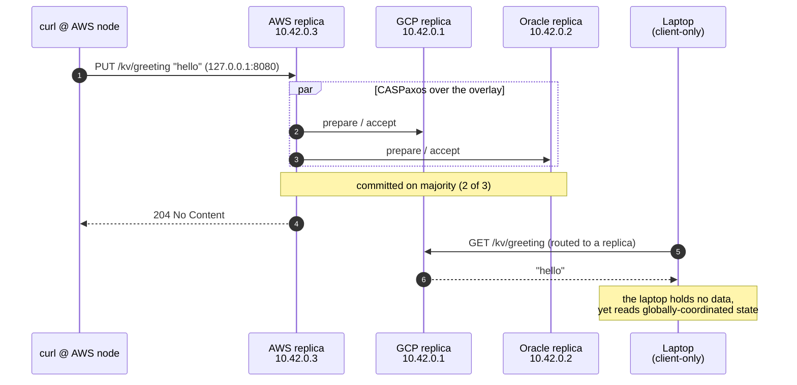
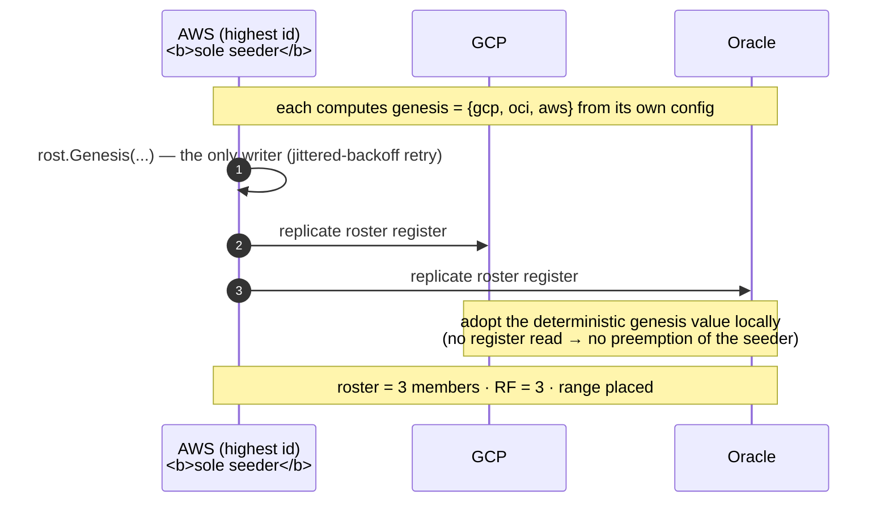
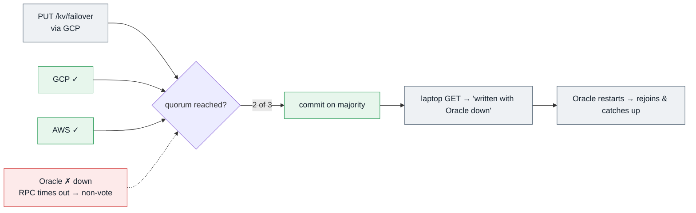

# cask multi-cloud demo — diagrams

Visual companions to [`demo/`](../../demo/). The hero diagram is a standalone SVG;
the rest are Mermaid (they render inline on GitHub and stay easy to edit).

## 1. Architecture

One cask cluster spanning GCP + Oracle + AWS as the RF=3 replica set, with a NAT'd
laptop joining as a client-only node — all over one encrypted Nebula overlay.

A Mermaid view of the same topology:

## 2. Read-after-write across clouds

Write on the AWS node; read it back on the laptop (which stores nothing) and on GCP.
Consensus commits on a majority and rides the overlay; the client API is local to each node.

## 3. Self-forming bootstrap (the genesis fix)

Every node derives the **same** genesis set from its config, so only one node writes
it — the highest node id, whose ballots dominate. Everyone else adopts the known
value locally instead of issuing write-imposing reads that would preempt the seeder
(the dueling-proposer livelock that took the real multi-lighthouse deploy down).

## 4. Fault tolerance — a replica fails, the cluster keeps serving

Stop Oracle's node: its overlay tunnel dies, so consensus RPCs to it time out fast
(bounded, ~4s) and count as non-votes. GCP + AWS are still a majority, so writes
commit and the laptop reads the new value.

## 5. Deploy pipeline (`demo/up.sh`)

How `up.sh` goes from three empty accounts to a running, interacting cluster.

```mermaid
flowchart LR
  classDef s fill:#eef1f4,stroke:#5A6B7B,color:#16222e
  classDef c fill:#e8f0fe,stroke:#4285F4,color:#16222e

  PF["preflight.sh<br/>tools · creds · live auth"]:::s --> UP["up.sh"]:::s
  UP --> PR["provision 3 clouds<br/>(parallel): VM + firewall + ssh key"]:::c
  PR --> B["build.sh<br/>host · linux/amd64 · linux/arm64"]:::s
  B --> SP["gen-spec.sh<br/>state → nodes.json"]:::s
  SP --> CG["cask gen-certs -spec<br/>CA + per-node Nebula configs"]:::s
  CG --> DP["deploy.sh<br/>scp arch-matched binary → systemd"]:::c
  DP --> LP["start laptop<br/>cask --client-only"]:::s
  LP --> IN["interact.sh<br/>cross-cloud read/write · lock · failover"]:::s
```

